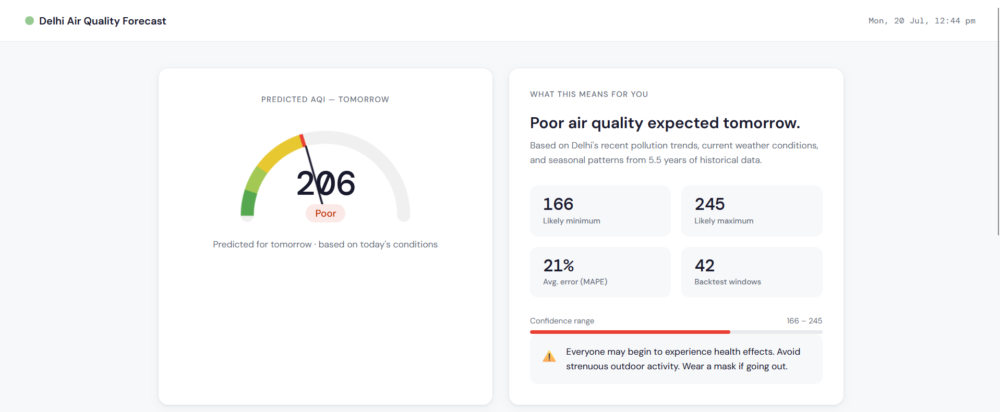
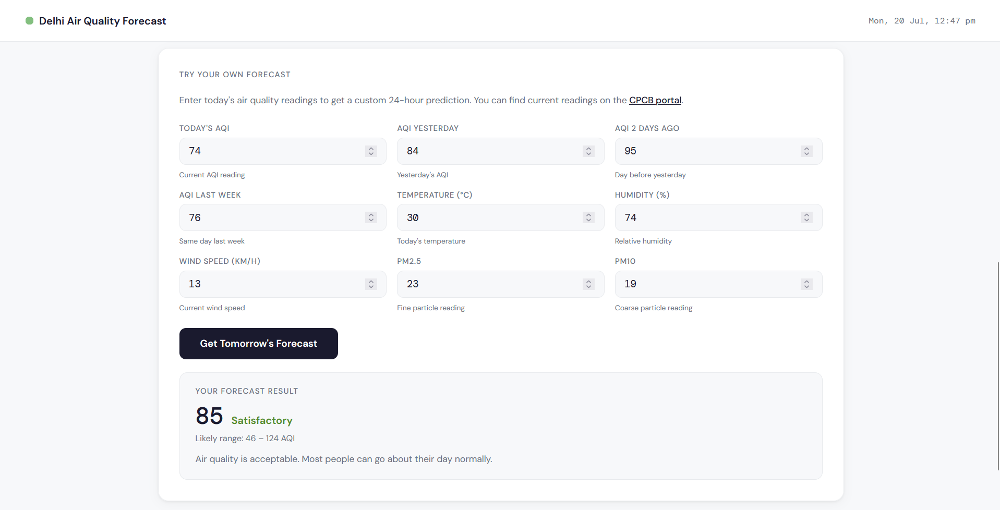
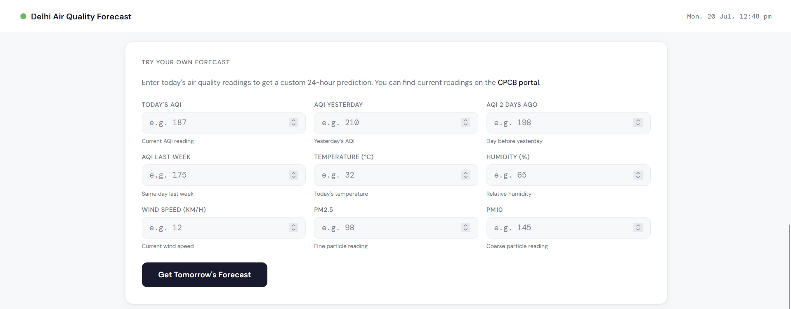
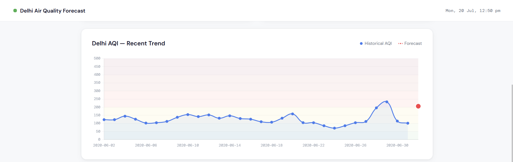
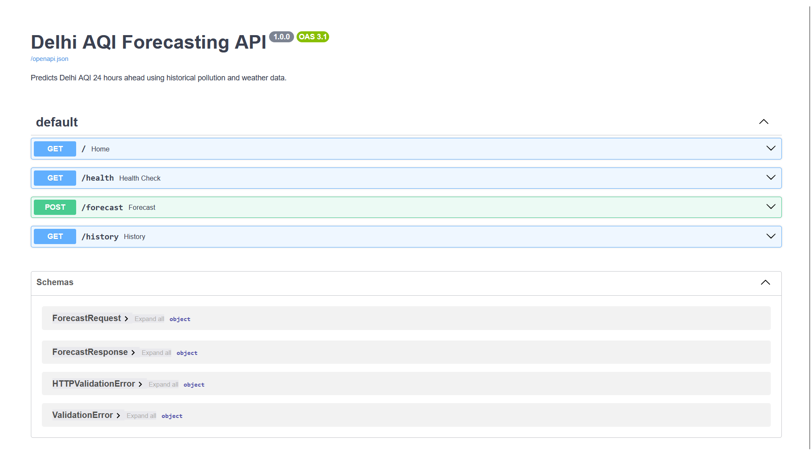
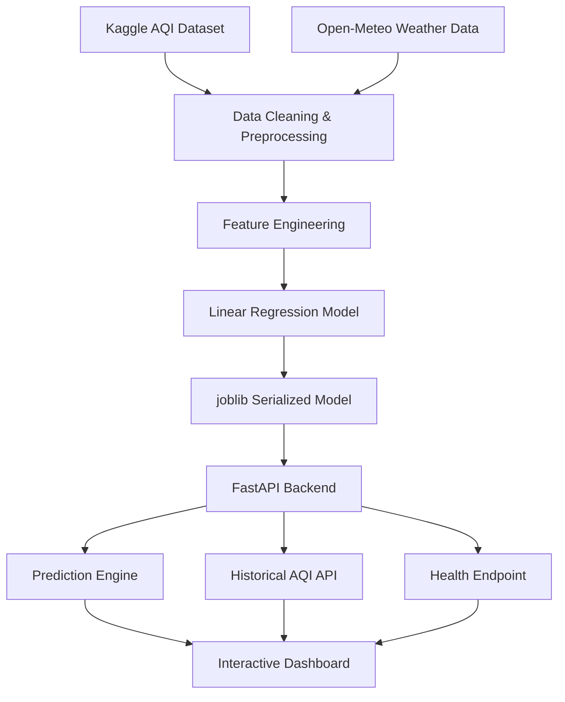

# 🌫️ AQI Forecaster

> **A production-ready machine learning web application that predicts Delhi's Air Quality Index (AQI) 24 hours in advance using historical pollution trends and weather conditions.**

[]()
[]()
[]()
[]()
[]()

---

## 🚀 Live Demo

🌐 **Dashboard:** [*(Render link here)*](https://aqi-forecaster-q1vv.onrender.com/)

📚 **API Documentation:** [*(Render link)/docs*](https://aqi-forecaster-q1vv.onrender.com/docs)


---

## 📸 Preview

### Dashboard



### Prediction



### Historical Chart


### Swagger UI


### Live Demo

<p align="center">
  
</p>

---

## 📖 Project Overview

Delhi frequently experiences hazardous air pollution levels, especially during the winter months. While public platforms provide **real-time AQI readings**, they rarely answer an equally important question:

> **"What will the air quality be tomorrow?"**

AQI Forecaster addresses this by predicting **Delhi's Air Quality Index (AQI) 24 hours in advance** using a machine learning model trained on historical air quality and weather data.

The application combines engineered temporal, pollution, and meteorological features with a **Linear Regression** model that was evaluated using a rolling time-series backtesting strategy to avoid data leakage. Predictions are served through a FastAPI backend and presented via an interactive web dashboard with confidence intervals, historical AQI visualization, and REST API endpoints.

This project demonstrates the complete machine learning lifecycle—from data preprocessing and feature engineering to model evaluation, API development, Docker containerization, and cloud deployment.

---

## ✨ Features

- 🔮 **24-Hour AQI Forecasting** – Predict Delhi's Air Quality Index one day in advance using a machine learning model.

- 📊 **Interactive Dashboard** – Clean web interface for entering pollution and weather data and viewing predictions.

- 📈 **Historical AQI Visualization** – Explore recent AQI trends through an interactive chart powered by historical data.

- 🎯 **Confidence Interval Estimation** – Every prediction includes an estimated uncertainty range based on the model's backtesting performance.

- 🚦 **AQI Category Classification** – Automatically classifies predictions into categories such as *Good*, *Moderate*, *Poor*, and *Severe*.

- ⚡ **REST API** – FastAPI-powered endpoints for seamless integration with external applications.

- 📚 **Interactive API Documentation** – Automatically generated Swagger UI for testing API endpoints.

- 📝 **Structured Logging** – Centralized logging for prediction requests, model loading, and API operations.

- ⚙️ **Configuration Management** – Centralized project configuration for paths, application metadata, and deployment settings.

- 🐳 **Docker Support** – Fully containerized application for consistent local development and cloud deployment.

---

## 📊 Model Performance

Three machine learning models were evaluated using a **rolling time-series backtesting strategy** across **42 evaluation windows (2018–2020)**. This approach ensures that the model is always tested on unseen future data, closely simulating real-world forecasting and preventing data leakage.

| Model | MAE ↓ | MAPE ↓ | RMSE ↓ |
|:------|------:|--------:|--------:|
| **Linear Regression** ✅ | **39.3** | **21.0%** | **57.1** |
| LightGBM | 41.6 | 22.4% | 61.4 |
| Random Forest | 42.7 | 23.4% | 64.6 |

### 🏆 Best Performing Model

Despite evaluating more complex ensemble models, **Linear Regression** consistently achieved the lowest prediction error.

This suggests that the engineered temporal, pollution, and weather features capture a largely linear relationship with AQI 24 hours ahead. More complex models such as LightGBM and Random Forest tended to overfit noise rather than improve generalization.

This result reinforces an important machine learning principle:

> **A simpler model with strong feature engineering often outperforms a more complex model.**

---

## 🏗️ System Architecture



---

## 🧠 Engineering Decisions

### Why Linear Regression?

Although ensemble models such as **LightGBM** and **Random Forest** were evaluated, **Linear Regression** consistently produced the lowest forecasting error during rolling backtesting.

The engineered lag, rolling statistics, and weather features created a largely linear relationship with the target, allowing a simpler model to generalize better while avoiding unnecessary complexity.

---

### Why Rolling Time-Series Backtesting?

Random train-test splits introduce **data leakage** for time-series problems because future observations can appear in the training data.

Instead, this project uses **rolling backtesting**, where each model is trained only on historical observations and evaluated on the next unseen time window. This closely mirrors how the model would perform in a real deployment.

---

### Why a 24-Hour Forecast?

A 1-hour prediction task produced unrealistically high accuracy because the model primarily learned to copy the previous hour's AQI.

Predicting **24 hours ahead** is significantly more challenging and requires the model to learn meaningful temporal, seasonal, pollution, and weather relationships rather than relying on short-term persistence.

---

### Why FastAPI?

FastAPI was chosen because it provides:

- Automatic request validation using Pydantic
- Interactive Swagger/OpenAPI documentation
- High-performance asynchronous request handling
- Clean architecture for building production-ready REST APIs

---

### Why Docker?

Docker ensures the application runs consistently across development and deployment environments by packaging the application, dependencies, and runtime configuration into a single reproducible container.

---

## 📂 Project Structure

```text
AQI-Forecaster/
│
├── api/
│   ├── main.py          # FastAPI application entry point
│   ├── routes.py        # API endpoints
│   ├── predictor.py     # Prediction & historical data logic
│   ├── schemas.py       # Request/response models
│   ├── config.py        # Centralized configuration
│   ├── logger.py        # Structured logging
│   └── utils.py         # Utility functions
│
├── data/
│   └── processed/
│       └── delhi_aqi_clean.csv
│   └── raw/
│       ├── city_day.csv
│       ├── city_hour.csv
│       ├── station_day.csv  
│       ├── station_hour.csv
│       └── stations.csv
│
│── models/
│   └── delhi_aqi_model.pkl
│
├── static/
│   ├── css/
│   └── js/
│
├── templates/
│   └── index.html
│
├── notebooks/
│   ├── 01_data_preparation.ipynb
│   └── 02_model_training.ipynb
│
├── Dockerfile
├── requirements.txt
├── .dockerignore
└── README.md
```
---

## 🚀 Getting Started

### Prerequisites

Before running the project, ensure you have:

- Python 3.13+
- Git
- Docker *(optional, for containerized deployment)*

---

## 📥 Installation

Clone the repository:

```bash
git clone https://github.com/Yash06-blip/AQI-Forecaster.git
cd AQI-Forecaster
```

Create a virtual environment:

```bash
python -m venv .venv
```

Activate the virtual environment:

**Windows**

```bash
.venv\Scripts\activate
```

**macOS / Linux**

```bash
source .venv/bin/activate
```

Install the dependencies:

```bash
pip install -r requirements.txt
```

Run the application:

```bash
uvicorn api.main:app --reload
```

The application will be available at:

- Dashboard → http://127.0.0.1:8000
- API Documentation → http://127.0.0.1:8000/docs
- Health Endpoint → http://127.0.0.1:8000/health

---

## 🐳 Running with Docker

Build the Docker image:

```bash
docker build -t aqi-forecaster .
```

Run the container:

```bash
docker run -p 8000:8000 aqi-forecaster
```

Open your browser:

- Dashboard → http://localhost:8000
- API Documentation → http://localhost:8000/docs

---

# 📡 API Reference

The application exposes RESTful endpoints for forecasting AQI, retrieving historical trends, and monitoring application health.

---

## GET `/`

Returns the interactive dashboard.

**Purpose**

- Load the web interface
- Submit AQI forecasting requests
- View historical AQI trends

---

## GET `/health`

Returns the application's health status and model metadata.

### Example Response

```json
{
  "status": "healthy",
  "model_version": "1.0.0",
  "trained_up_to": "2020-06-30",
  "backtest_MAE": 39.3,
  "backtest_MAPE_percent": 21,
  "n_features": 29
}
```

---

## POST `/forecast`

Generates a 24-hour AQI forecast using historical pollution, weather, and temporal features.

### Example Request

```json
{
  "AQI_lag_24h": 187.0,
  "AQI_lag_48h": 210.0,
  "AQI_lag_72h": 198.0,
  "AQI_lag_168h": 175.0,
  "AQI_lag_8760h": 220.0,
  "AQI_rolling_mean_24h": 195.0,
  "AQI_rolling_mean_48h": 200.0,
  "AQI_rolling_std_24h": 18.5,
  "AQI_rolling_max_24h": 230.0,
  "AQI_rolling_min_24h": 160.0,
  "PM2.5": 98.5,
  "PM10": 145.0,
  "NO2": 52.3,
  "CO": 1.8,
  "SO2": 14.2,
  "O3": 28.5,
  "temperature_lag_24h": 18.5,
  "humidity_lag_24h": 72.0,
  "windspeed_lag_24h": 8.2,
  "precipitation_lag_24h": 0.0,
  "temperature_rolling_mean_24h": 19.2,
  "humidity_rolling_mean_24h": 68.0,
  "windspeed_rolling_mean_24h": 9.1,
  "precipitation_rolling_mean_24h": 0.0,
  "forecast_datetime": "2019-11-15 14:00:00"
}
```

### Example Response

```json
{
  "forecast_datetime": "2019-11-16 14:00:00",
  "predicted_AQI": 233.2,
  "AQI_lower_bound": 193.9,
  "AQI_upper_bound": 272.5,
  "AQI_category": "Poor",
  "model_MAE": 39.3,
  "model_MAPE_percent": 21,
  "message": "Predicted AQI for Delhi 24 hours from 2019-11-15 14:00 is 233.2 (Poor)"
}
```

---

## GET `/history`

Returns historical daily average AQI values used by the dashboard visualization.

### Example Response

```json
{
  "dates": [
    "2020-06-01",
    "2020-06-02",
    "2020-06-03"
  ],
  "aqi_values": [
    182.4,
    176.8,
    190.7
  ],
  "source": "CPCB Delhi monitoring data 2015-2020",
  "days": 30
}
```

---

# 📈 Model Features

The forecasting model uses **29 engineered features** derived from historical AQI measurements, weather conditions, and temporal information.

| Category | Features |
|----------|----------|
| 🕒 Temporal | Hour, Day of Week, Month, Weekend Flag, Season |
| 🌫 AQI History | AQI lag (24h, 48h, 72h, 168h, 8760h) |
| 📊 Rolling Statistics | 24h Mean, 48h Mean, 24h Std, 24h Max, 24h Min |
| 🏭 Pollutants | PM2.5, PM10, NO₂, CO, SO₂, O₃ |
| 🌦 Weather | Temperature, Humidity, Wind Speed, Precipitation (lagged and rolling means) |

These engineered features allow the model to capture both **short-term pollution dynamics** and **longer-term seasonal trends**, improving its ability to forecast AQI 24 hours into the future.

---

# 📁 Dataset

The forecasting model was trained using publicly available air quality and weather datasets.

| Source | Description |
|----------|-------------|
| **Kaggle – Air Quality Data in India** | Hourly AQI and pollutant measurements for Delhi (2015–2020), sourced from CPCB monitoring stations. |
| **Open-Meteo** | Historical hourly weather observations including temperature, humidity, wind speed, and precipitation. |

### Data Processing

Before training, the datasets were:

- Merged on hourly timestamps
- Cleaned and imputed for missing values
- Converted into temporal features
- Enhanced with lag features
- Enhanced with rolling statistical features
- Used for rolling time-series backtesting

---

# 🔮 Future Improvements

Some planned enhancements for future iterations of the project include:

- 📍 Support forecasting for multiple Indian cities instead of Delhi only.
- ☁️ Replace CSV-based historical data with a PostgreSQL database.
- 📡 Integrate live AQI and weather APIs for real-time forecasting.
- 📱 Improve the dashboard with mobile-first responsive design.
- 📈 Add feature importance and prediction explanation visualizations.
- 🔄 Automate periodic model retraining using updated datasets.
- 🚀 Deploy CI/CD pipelines for automated testing and deployment.

---

# 👨‍💻 Author

**Yash Bagde**

Aspiring Software Engineer | Machine Learning & Backend Development

- GitHub: https://github.com/Yash06-blip
- LinkedIn: https://www.linkedin.com/in/yash-0613-bagde
